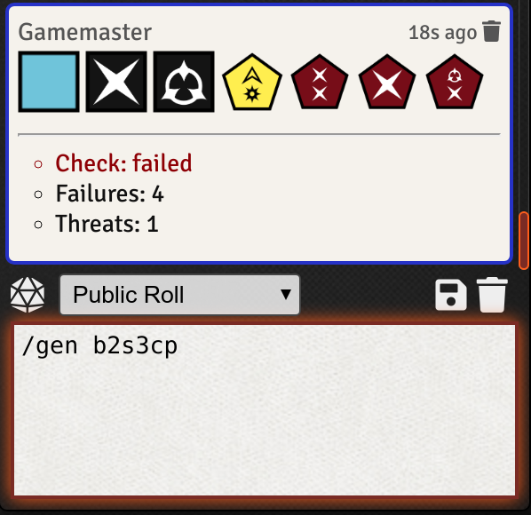
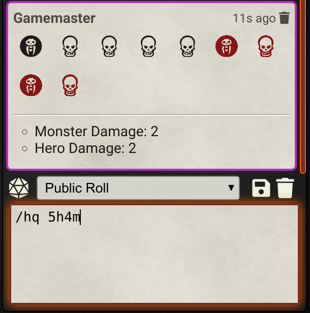
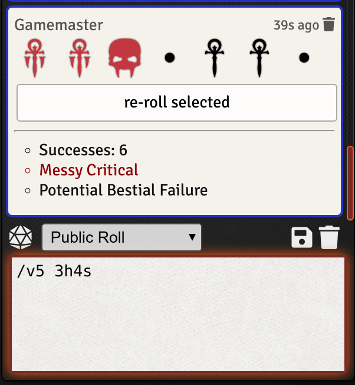

# Special Dice Roller

[](https://travis-ci.org/BernhardPosselt/l5r-foundryvtt-roller)

Supports rolling dice in your chat window for various non regular dice systems:

* Legend of the 5 Rings 5th edition
* Vampire the Masquerade 5th edition
* Genesys
* FFG's Star Wars TTRPG

L5R, Genesys and Star Wars images are taken from [SkyJedi's Discord Roller](https://github.com/SkyJedi/FFGNDS-Discord-Dice-Roller)
Vampire the Masquerade images are taken from and [Lumi#5953's Thirst Discord bot](https://www.google.com/url?sa=t&rct=j&q=&esrc=s&source=web&cd=1&cad=rja&uact=8&ved=2ahUKEwj-iKLCjNvmAhWOyqYKHaYEC7AQFjAAegQIAhAB&url=https%3A%2F%2Fdiscordapp.com%2Foauth2%2Fauthorize%3Fclient_id%3D475234745848954905%26scope%3Dbot%26permissions%3D0&usg=AOvVaw0fV9gFSh3hD3WQd2BwJKv7). 

# Installation

Go to your setup page and click on the **Add-on Modules** Tab.

Hit the button **Install Module** at the bottom.

Insert the module URL https://github.com/BernhardPosselt/foundryvtt-special-dice-roller/raw/master/module.json and click **Install**.

After you've launched your game, go to the Game Settings page and click on **Manage Modules**. Enable the Special Dice Roller app and hit **Save Module Settings**.


# Usage

You can roll a system by starting your message with the following string:

* Legend of the 5 Rings: /l5r
* FFG Star Wars: /sw
* FFG Genesys: /gen
* Vampire the Masquerade: /v5

Then supply a dice formula separated with a space. The formula consists of dice letters that are optionally prefixed with a number.

A full roll example would be **/l5r rrs** or **/l5r 2rs**.

## Usage L5R

Roll Legend of the 5 Rings 5th edition dice in the chat window. Auto rolls exploding successes and let's you keep/re-roll selected dice.

Use the **/l5r** command using the following dice letters:

* r, b: ring
* s, w: skill


You can choose to either keep or re-roll certain dice. To do that, click on the dice to select them and hit either button. Re-rolled dice are removed from the roll and new rolls are attached at the end.

## Usage Genesys/Star Wars

Usage is similar to L5R but re-rolls and keeping dice is unsupported. Use the **/gen** or **/sw** commands using the following dice letters:

* b: boost
* s: setback
* a: ability
* d: difficulty
* p: proficiency
* c: challenge
* f: force (sw only)



## Usage HeroQuest

Use **/hq** to roll dice using the following dice letters:

* h: hero
* m: monster



## Usage Vampire the Masquerade

Usage is similar to L5R but keeping dice is unsupported. Use the **/v5** command using the following dice letters:

* b, s: skill dice
* h, r: hunger dice

You can choose to re-roll certain dice. To do that, click on the dice to select them and hit the re-roll button. Re-rolled dice are highlighted with a green border.



# Building the Project

Install **yarn** and run:

    yarn install
    yarn build

Tests use Jest and are run via:

    yarn test
    
TSLint is used to lint files on build. You can run it separately via

    yarn run lint

and fix simple errors automatically via:

    yarn run fix

The relevant files and folders that need to be included in your (local) FoundryVTT module folder are:

* module.json
* dist/
* public/

Further development documentation is included in the docs/ folder.

# Rolling Dice Programmatically

You can access the dice roller API via the game object:

```js
game.specialDiceRoller.l5r
game.specialDiceRoller.v5
game.specialDiceRoller.genesys
game.specialDiceRoller.starWars
game.specialDiceRoller.heroQuest
```

Each roller object has a rollFormula method:

```ts
class Roller {
    /**
      * @param fomula essentially the command without the roller prefix (e.g. wwbb instead of /l5r wwbb)
      * @param flavorText? flavor text to display above the roll
      * @return the HTML for the chat window
      */
    rollFormula(formula: string, flavorText?: string): string {
        // etc
    }
}
```

This method returns the formatted HTML for a roll. You can insert that into the chat log content.
